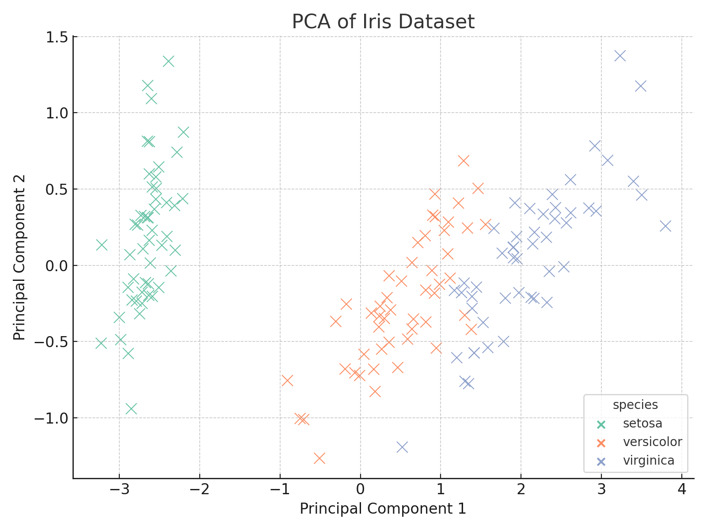

# CodeAlpha Data Science Internship – Task 1

## 📌 Task: Classification with Logistic Regression, Decision Tree, and SVM

This project is part of my internship at **CodeAlpha** under the **Data Science** domain.

### 🔍 Dataset
I used the classic [Iris dataset](https://archive.ics.uci.edu/ml/datasets/Iris) to build and evaluate classification models.

### 📦 Libraries Used
- `readr`
- `caret`
- `e1071`
- `nnet`
- `rpart`
- `ggplot2`
- `dplyr`

### 🧠 Models Implemented
1. **Logistic Regression (Multinomial)**
2. **Decision Tree**
3. **Support Vector Machine (SVM)**

### 📈 Accuracy Results
| Model               | Accuracy (%) |
|--------------------|--------------|
| Logistic Regression| ~97%         |
| Decision Tree      | ~95%         |
| SVM                | ~98%         |

### 🖼️ Visualization

I used PCA to reduce dimensionality and visualized the dataset:

### 🔗 Connect with Me
Feel free to reach out or check out my LinkedIn update: [Sanyam Mazhi](https://www.linkedin.com)

### 🚀 Tags
`#CodeAlpha #DataScience #RProgramming #Classification #Internship`
